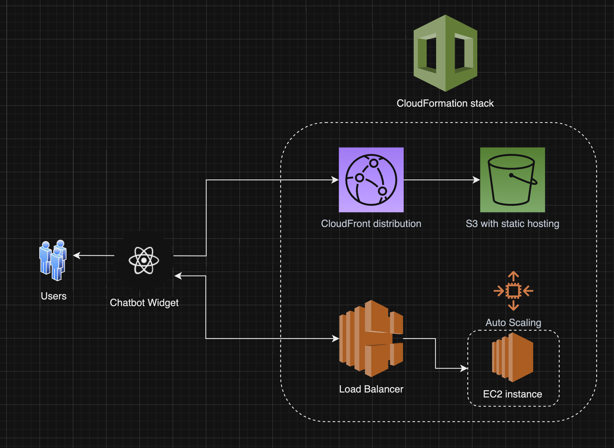

# Artisan Chatbot Infrastructure Module

This is a Infrastructure-as-Code module to deploy the ArtisanAI Chatbot app in AWS.

This project uses the AWS CDK with TypeScript.

The `cdk.json` file tells the CDK Toolkit how to execute your app.

## Infrastructure overview 🏗️
### Resources



All resources are hosted in AWS for simplicity and consistency.

The infrastructure resides in a CloudFormation Stack, which contains the following resources:

* An S3 bucket with [static website hosting](https://docs.aws.amazon.com/console/s3/hostingstaticwebsite) enabled, storing the Chatbot client app's static HTML/CSS/JS files
* A CloudFront distribution, to serve such static files
* An EC2 instance with a Docker container running the API

### Data flow

1. The user access the app's DNS, that redirects to the CloudFront's distribution CNAME.
    * At the time of this writing, there's no DNS domain purchased. So the user will access the distribution's DNS directly.
2. The distribution fetches the origin's (S3 bucket) data, and serves them as a standard webserver would.
    * HTTP headers must be allowed here.
3. The user's browser then renders the Chatbot Widget app, which sends HTTP requests to the EC2 instance public DNS
    * Whenever we purchase a DNS domain, we should also add a subdomain CNAME record to the EC2 name.

## Deploying 🛠️

### Requirements
* You must have the AWS CDK v2 installed


### Steps
If you're deploying this project for the first time in your own AWS account, you must bootstrap the CDK resources.\
Do that by running:
```shell
cdk bootstrap
```


1. Ensure there's a `build` directory in the frontend module

    * Running `npm run build` in `../artisanai-chatbot-widget` does the trick.

2. Synthesize the resources
    ```shell
    cdk synth
    ```
3. Deploy the resources
    ```shell
    cdk deploy
    ```
    * Note that to create the initial resources it will take several minutes. That's due to the CloudFront distribution, which sets up a global CDN for us.
4. Set the backend endpoint in the frontend app

    * While there's no static DNS, this step is required

    * Copy the `Ec2PublicEndpoint` from the outputs

    * Paste it in `../artisanai-chat-widget/.env`

    * Re-build the frontend

    * Re-deploy (repeat step 3.)

Note that changes to the frontend may take some time to propagate to CloudFront's CDN.\
You either have to wait or manually invalidate the distribution.

## Next steps

* Add a command in package.json to upload the frontend build
* Add a command in package.json to build and push the backend Docker image
* Create a .env for the infrastructure module.
* Setup a GitHub action to run this module and re-deploy upon merges.
